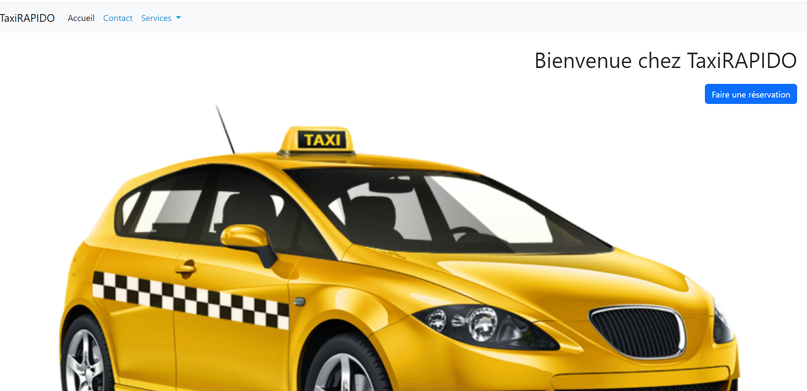

# Rapport de TP WEP

Rédigé par:  SEFAN H. Gwladys                                           
 Chargé du cours : SANDA Tidjani

-----------                                                            -------------------

----------------------------------------------------------------------------

### Introduction

#### Contexte
Ce rapport présente les travaux pratiques réalisés dans le cadre du développement d'une application web de gestion des courses de taxi. L'objectif est de pouvoir ajouter des courses, affecter des chauffeurs, gérer les courses en générale.
#### Problème
Le problème principal adressé dans ce TP est de créer un système de gestion de courses de taxi efficace et convivial, intégrant différentes fonctionnalités pour les utilisateurs. L'application doit assurer une gestion fluide des réservations, des affectations de chauffeurs et des statuts des courses.

#### Plan du Document
1. Présentation du sujet
2. Schéma relationnel de la BD
3. Réalisation
    1. Outils utilisés
    2. Dessin d'écran
4. Conclusion
    - Point des réalisations
    - Impression
    - Perspectives

---

### I. Présentation du sujet
Le sujet de ce TP consiste à développer une application web de gestion des courses de taxi. Les fonctionnalités principales incluent la réservation de courses par les utilisateurs, l'affectation de chauffeurs, et la gestion des statuts. L'application est conçue pour être intuitive, offrant une expérience utilisateur optimale.

---

### II. Schéma Relationnel de la BD
Le schéma relationnel de la base de données est composé des tables suivantes :

#### Table `chauffeurs`
- `id` (int, auto-increment, primary key)
- `nom` (varchar)
- `prenom` (varchar)
- `telephone`(varchar)
- `sexe` (varchar)
- `disponibilite` (boolean)

#### Table `courses`
- `id` (int, auto-increment, primary key)
- `point_depart` (varchar)
- `point_arrive` (varchar)
- `date_heure` (datetime)
- `statut` (varchar)
- `chauffeur_id` (int, foreign key referencing `utilisateurs(id)`)

---

### III. Réalisation

#### 1. Outils utilisés
- **Langages de programmation** : PHP, HTML, CSS, JavaScript
- **Frameworks et bibliothèques** : Bootstrap (pour le design), jQuery (pour l'interactivité)
- **Système de gestion de base de données** : MySQL
- **Serveur web** : Apache (XAMPP)
- **Environnement de développement** : Visual Studio Code

#### 2. Dessin d'écran
- **Page d'accueil**
  
- **Ajouter une course**
  
- **Course en attente**
  
- **Course en cours**
  
- **Toutes les courses**
  

---

### Conclusion

#### Point des réalisations
L'application développée permet aux utilisateurs de réserver des courses, aux administrateurs d'affecter des chauffeurs, et aux chauffeurs de gérer les statuts des courses. Toutes les fonctionnalités sont intégrées et fonctionnent correctement.

#### Impression
Le projet a permis de mettre en pratique les concepts appris en cours, notamment la gestion des bases de données relationnelles et le développement d'une interface utilisateur avec Bootstrap.

#### Perspectives
Pour les travaux futurs, il serait intéressant d'ajouter des fonctionnalités supplémentaires telles que :
 - La possibilité pour les utilisateurs de modifier ou annuler leurs réservations
 - L'implémentation de la sécurité avec le hachage des mot de passe
 - ....
